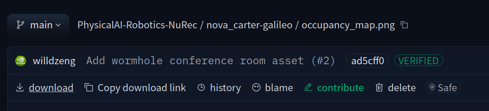

# Foxglove API with Nova Carter

## Downloading the dataset

Download the dataset in [HuggingFace](https://huggingface.co/datasets/nvidia/PhysicalAI-Robotics-NuRec/tree/main/nova_carter-galileo).

You can download each file or folder by clicking the *download*  button on the top left side 

## Initialize project

1. Install `uv`
2. Run `uv sync` in this folder
3. Use the virtual environment `source .venv/bin/activate`

## Foxglove TOKEN
Create a .env file and store your Foxglove API token there as follow

FOXGLOVE_API="fox_sk_your_key_here...."
